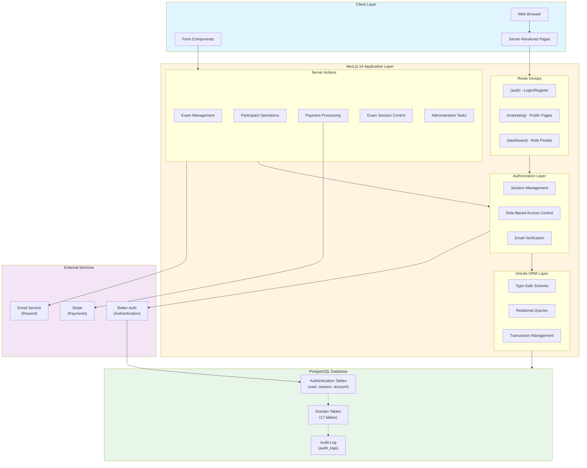

# GATE Platform Architecture Documentation

**Version:** 1.0  
**Last Updated:** 2026-05-11  
**Status:** Active

## Overview

The **G.A.T.E. (Global Assessment for Talent and Excellence)** platform is a comprehensive, multi-role online assessment system designed to facilitate standardized academic examinations across multiple regions, subjects, and grade levels. The platform supports the complete examination lifecycle from participant registration through exam administration to results publishing and certificate generation.

### Platform Purpose

The GATE platform enables:
- **Participant enrollment** in assessment cycles with subject selection and payment processing
- **Online examination delivery** with proctoring features and adaptive question presentation
- **Multi-role administration** with distinct portals for admins, coordinators, partners, and question providers
- **Complete assessment lifecycle management** from cycle planning through results publication
- **Secure, scalable exam delivery** with session management and automatic grading

### Key Features

- ✅ **Multi-tenant Role-Based Access Control** - 7 distinct user roles with granular permissions
- ✅ **Hierarchical Assessment Structure** - Cycles → Rounds → Exams → Questions → Sessions
- ✅ **Online Exam Proctoring** - Tab-switch detection, timed sessions, deadline enforcement
- ✅ **Automatic Grading** - Real-time scoring for MCQ and numeric questions
- ✅ **Payment Integration** - Stripe payment processing with fee management
- ✅ **Certificate Generation** - Automated digital certificate creation
- ✅ **Audit Logging** - Comprehensive activity tracking for compliance
- ✅ **Type-Safe Development** - End-to-end TypeScript with Drizzle ORM
- ✅ **Server-Side Rendering** - Next.js 14 App Router with React Server Components

---

## High-Level System Architecture

The following diagram illustrates the complete system architecture, showing all major components and their interactions:



### Architecture Layers

#### 1. **Client Layer**
- **Technology:** React 18, TypeScript, TailwindCSS
- **Pattern:** Server-Side Rendering (SSR) with progressive enhancement
- **Components:** Server Components (default) with selective Client Components for interactivity
- **Forms:** Server Actions with progressive enhancement via `useFormStatus`

#### 2. **Application Layer (Next.js 14)**
- **Framework:** Next.js 14 with App Router
- **Routing:** File-based routing with route groups for role-based organization
- **Data Fetching:** Server Components with direct async data access
- **Mutations:** Server Actions for all data modifications
- **Caching:** Next.js automatic caching with explicit `revalidatePath()` invalidation

#### 3. **Authorization Layer**
- **Authentication:** Better Auth with session-based authentication
- **Authorization:** Custom middleware (`lib/authz.ts`) with role-based access control
- **Session Management:** Server-side session validation on every protected route
- **Email Verification:** Required before accessing participant and partner dashboards

#### 4. **Data Layer**
- **ORM:** Drizzle ORM with TypeScript schema definitions
- **Database:** PostgreSQL with 22 tables (4 auth, 17 domain, 1 audit)
- **Transactions:** ACID-compliant transactions for critical operations
- **Migrations:** Version-controlled schema migrations via Drizzle Kit

#### 5. **External Services**
- **Authentication:** Better Auth for user management and sessions
- **Payments:** Stripe for payment processing and fee calculations
- **Email:** Resend for transactional email delivery
- **File Storage:** (Future) S3-compatible storage for certificates and documents

---

## Documentation Index

This architecture documentation is organized into focused documents covering specific aspects of the system:

### Core Documentation

#### 1. [Authorization Documentation](./AUTHORIZATION.md)
**Purpose:** Complete reference for authentication, authorization, and role-based access control.

**Contents:**
- 7 user roles and their permissions
- Authorization middleware functions (`requireSession`, `requireRole`, `requireParticipant`)
- Route protection patterns
- Email verification requirements
- Home route mapping (role-based dashboard redirection)

**When to use:** Implementing new protected routes, adding role-based features, debugging authorization issues.

---

#### 2. [Route Mapping Documentation](./ROUTE_MAPPING.md)
**Purpose:** Comprehensive mapping of all 68 application routes organized by role and route group.

**Contents:**
- Complete route inventory across 9 route groups
- Role-based access requirements per route
- Navigation structure for each role dashboard
- Route group layouts and authorization patterns
- Special features (progress tracker, proctoring, etc.)

**When to use:** Understanding the application structure, planning new routes, documenting API endpoints, onboarding new developers.

---

#### 3. [Database Schema Documentation](./DATABASE.md)
**Purpose:** Complete database schema reference with all tables, relationships, and indexes.

**Contents:**
- 22 tables with full column definitions
- Entity-relationship diagram (ERD)
- 15 enums with all possible values
- Foreign key relationships and cascading rules
- Indexes and unique constraints
- Query patterns and performance considerations

**When to use:** Implementing database queries, understanding data relationships, planning schema changes, optimizing query performance.

---

#### 4. [Exam Lifecycle Documentation](./EXAM_LIFECYCLE.md)
**Purpose:** Complete examination lifecycle from creation through grading and results publication.

**Contents:**
- 9-stage exam lifecycle (creation → submission → grading)
- Detailed sequence diagrams for each stage
- Session start logic and eligibility checks
- Answer saving and validation
- Auto-grading algorithms for MCQ, numeric, and open-ended questions
- Manual grading workflows
- Results publication and certificate generation

**When to use:** Implementing exam features, debugging exam sessions, understanding grading logic, troubleshooting submission issues.

---

#### 5. [Data Flow Architecture](./DATA_FLOW.md)
**Purpose:** Comprehensive data flow patterns following Database → Drizzle ORM → Server Actions → UI Components.

**Contents:**
- Unidirectional data flow architecture
- Layer responsibilities and boundaries
- Example flows (create, read, update, delete)
- Cache invalidation strategy
- Error handling patterns
- Best practices and anti-patterns

**When to use:** Implementing new features, understanding data mutations, optimizing performance, debugging cache issues.

---

## Quick Reference

### System Components

| Component | Technology | Location | Purpose |
|-----------|-----------|----------|---------|
| **Frontend** | Next.js 14 + React 18 | `app/` | Server-rendered UI with route groups |
| **Authentication** | Better Auth | `lib/auth.ts` | User authentication and session management |
| **Authorization** | Custom Middleware | `lib/authz.ts` | Role-based access control |
| **Database ORM** | Drizzle ORM | `db/schema/` | Type-safe database queries |
| **Database** | PostgreSQL | External | Data persistence |
| **Payment Processing** | Stripe | External | Payment gateway integration |
| **Email** | Resend | External | Transactional email delivery |
| **Styling** | TailwindCSS | `app/` | Utility-first CSS framework |
| **Validation** | Zod | `lib/` | Runtime type validation |

### Key File Locations

```
GATE/
├── app/                          # Next.js App Router
│   ├── (auth)/                   # Authentication pages (public)
│   ├── (marketing)/              # Public marketing pages
│   └── (dashboard)/              # Protected role-based dashboards
│       ├── admin/                # Admin portal (25 routes)
│       ├── coordinator/          # Coordinator portal (3 routes)
│       ├── participant/          # Participant portal (12 routes)
│       ├── partner/              # Partner portal (3 routes)
│       └── qp/                   # Question provider portal (6 routes)
├── db/
│   ├── schema/                   # Drizzle ORM schemas
│   │   ├── auth.ts               # Authentication tables
│   │   ├── exams.ts              # Exam-related tables
│   │   ├── participants.ts       # Participant tables
│   │   ├── content.ts            # Content tables
│   │   └── enums.ts              # Enum definitions
│   └── index.ts                  # Database connection
├── lib/
│   ├── auth.ts                   # Better Auth configuration
│   ├── authz.ts                  # Authorization middleware
│   ├── actions/                  # Server actions
│   └── utils.ts                  # Utility functions
├── docs/                         # Architecture documentation
│   ├── ARCHITECTURE.md           # This file (main entry point)
│   ├── AUTHORIZATION.md          # Auth & authz patterns
│   ├── ROUTE_MAPPING.md          # All routes by role
│   ├── DATABASE.md               # Database schema
│   ├── EXAM_LIFECYCLE.md         # Exam process flows
│   └── DATA_FLOW.md              # Data architecture
└── ARCHITECTURE.html             # Visual architecture reference
```

### Database Hierarchy

The core exam system follows this hierarchical structure:

```
cycles (assessment cycles, e.g., "2025 Academic Year")
  └── rounds (phases within cycle, e.g., "Round 1 - Online", "Round 2 - Onsite")
        └── exams (subject assessments, e.g., "Mathematics Grade 9")
              └── questions (individual exam items)
                    └── exam_sessions (participant attempts)
                          └── exam_answers (individual responses)
```

**Enrollment Structure:**
- Participants enroll in a **cycle** (e.g., "2025 Academic Year")
- Select which **round** to participate in (e.g., "Round 1 - Online")
- Choose **subjects** (e.g., "Mathematics", "Science")
- Payment is processed for the selected round + subjects
- Access is granted to all **exams** matching their enrolled subjects in that round

### User Roles

| Role | Identifier | Access Level | Primary Use Case |
|------|------------|--------------|------------------|
| **Super Admin** | `super_admin` | Full system access | System configuration, user management, cycles |
| **Admin** | `admin` | Administrative | Exam management, participant oversight, results |
| **Coordinator** | `coordinator` | Regional | Manage participants in assigned region |
| **Participant** | `participant` | Student | Take exams, view results, download certificates |
| **Partner Contact** | `partner_contact` | Organization | Manage partner organization details |
| **Question Provider** | `question_provider` | Content | Provide and manage exam questions |
| **Career Applicant** | `career_applicant` | Limited | View job postings, submit applications |

### Common Operations

#### Creating an Exam
1. Navigate to `/admin/exams/new`
2. Select cycle, round, and subject
3. Configure exam settings (type, duration, window)
4. Add questions via `/admin/exams/[id]/questions/new`
5. Publish exam (makes it available to participants)

#### Participant Enrollment
1. Register account → Email verification
2. Complete profile (`/participant/profile`)
3. Select cycle, round, subjects (`/participant/enrollment`)
4. Process payment via Stripe
5. Access exams (`/participant/exams`)

#### Taking an Exam
1. Participant navigates to `/participant/exams/[id]`
2. Click "Start Exam" → Creates `exam_session`
3. Answer questions → Saves to `exam_answers`
4. Submit exam → Auto-grades MCQ/numeric, manual review for open-ended
5. View results → `/participant/exams/[id]/result`

---

## Technology Stack

### Core Framework
- **Next.js 14** - React framework with App Router
- **React 18** - UI library with Server Components
- **TypeScript** - Type-safe development
- **TailwindCSS** - Utility-first CSS framework

### Backend
- **Drizzle ORM** - Type-safe ORM for PostgreSQL
- **PostgreSQL** - Relational database
- **Better Auth** - Authentication library
- **Zod** - Runtime type validation

### External Services
- **Stripe** - Payment processing
- **Resend** - Transactional email
- **Vercel** (recommended) - Deployment platform

### Development Tools
- **ESLint** - Code linting
- **Prettier** - Code formatting
- **Drizzle Kit** - Database migrations
- **TypeScript** - Static type checking

---

## Security Features

### Authentication & Authorization
- ✅ Session-based authentication with secure cookie storage
- ✅ Email verification required for participant and partner access
- ✅ Role-based access control (RBAC) enforced on every protected route
- ✅ Server-side session validation (no client-side auth checks)
- ✅ Secure password hashing via Better Auth

### Exam Security
- ✅ Tab-switch detection and logging
- ✅ Session deadline enforcement (auto-timeout)
- ✅ IP address and user agent tracking
- ✅ Question shuffling and randomization
- ✅ One-attempt enforcement for formal exams
- ✅ Participant-session ownership validation

### Data Security
- ✅ All mutations through server actions (no client-side DB access)
- ✅ Input validation with Zod schemas
- ✅ SQL injection protection via parameterized queries
- ✅ Foreign key constraints prevent orphaned records
- ✅ Audit logging for critical operations

### Payment Security
- ✅ PCI-compliant payment processing via Stripe
- ✅ No credit card data stored in database
- ✅ Payment intent verification before enrollment confirmation
- ✅ Fee calculations stored in cycle configuration

---

## Performance Considerations

### Caching Strategy
- **Next.js Automatic Caching** - All Server Component renders cached by default
- **Explicit Invalidation** - `revalidatePath()` after mutations
- **Selective Revalidation** - Only invalidate affected routes (e.g., `/admin/exams` after exam creation)

### Database Optimization
- **Indexes** - All foreign keys indexed, unique constraints on email/slug fields
- **Query Optimization** - Use `findFirst()` instead of `findMany()[0]`
- **Relation Loading** - Eager load related data with `with` clause
- **Connection Pooling** - Configured via database connection string

### Page Load Optimization
- **Server-Side Rendering** - Reduces client-side JavaScript bundle
- **Code Splitting** - Automatic route-based code splitting
- **Image Optimization** - Next.js Image component for optimized delivery
- **Font Optimization** - Next.js font optimization for web fonts

---

## Development Workflow

### Adding a New Feature

1. **Plan Data Model** - Review [DATABASE.md](./DATABASE.md) and plan schema changes if needed
2. **Create Migration** - Use Drizzle Kit to generate migration: `npm run db:generate`
3. **Apply Migration** - Run migration: `npm run db:migrate`
4. **Create Server Actions** - Add business logic in `lib/actions/`
5. **Add Authorization** - Use `requireRole()` to protect actions
6. **Create UI Components** - Add page in appropriate route group
7. **Test** - Verify role-based access, edge cases, error handling
8. **Update Documentation** - Update relevant docs if needed

### Common Development Tasks

#### Generate Database Migration
```bash
npm run db:generate
npm run db:migrate
```

#### Add New User Role
1. Add role to `roleEnum` in `db/schema/enums.ts`
2. Generate migration
3. Update `lib/authz.ts` with role-specific logic
4. Create route group in `app/(dashboard)/[role]/`
5. Update [AUTHORIZATION.md](./AUTHORIZATION.md) and [ROUTE_MAPPING.md](./ROUTE_MAPPING.md)

#### Create New Protected Route
```typescript
// app/(dashboard)/admin/new-feature/page.tsx
import { requireRole } from "@/lib/authz";

export default async function NewFeaturePage() {
  const session = await requireRole(["admin", "super_admin"]);
  
  // Fetch data directly in Server Component
  const data = await db.query.someTable.findMany();
  
  return (
    <div>
      {/* Render UI */}
    </div>
  );
}
```

#### Create Server Action
```typescript
// lib/actions/new-actions.ts
"use server";

import { requireRole } from "@/lib/authz";
import { db } from "@/db";
import { revalidatePath } from "next/cache";

export async function createSomething(formData: FormData) {
  const session = await requireRole(["admin", "super_admin"]);
  
  // Validate input
  // Perform database operation
  await db.insert(someTable).values({...});
  
  // Invalidate cache
  revalidatePath("/admin/some-path");
  
  return { success: true };
}
```

---

## Troubleshooting

### Common Issues

#### Authorization Errors
- **Issue:** "Unauthorized" error on protected route
- **Solution:** Check `requireRole()` in page component, verify user role in database
- **Reference:** [AUTHORIZATION.md](./AUTHORIZATION.md)

#### Exam Session Issues
- **Issue:** Session not starting or timing out unexpectedly
- **Solution:** Check exam window times, verify participant enrollment, review session status
- **Reference:** [EXAM_LIFECYCLE.md](./EXAM_LIFECYCLE.md)

#### Database Query Issues
- **Issue:** Type errors or missing relations
- **Solution:** Check schema definitions, verify relation names match table names
- **Reference:** [DATABASE.md](./DATABASE.md)

#### Cache Stale Data
- **Issue:** UI showing old data after mutation
- **Solution:** Add `revalidatePath()` after mutation in server action
- **Reference:** [DATA_FLOW.md](./DATA_FLOW.md) - Cache Invalidation section

---

## Additional Resources

### External Documentation
- [Next.js 14 Documentation](https://nextjs.org/docs)
- [Drizzle ORM Documentation](https://orm.drizzle.team/docs/overview)
- [Better Auth Documentation](https://better-auth.com)
- [TailwindCSS Documentation](https://tailwindcss.com/docs)
- [Stripe API Documentation](https://stripe.com/docs/api)

### Internal Resources
- **ARCHITECTURE.html** - Visual architecture reference with styled diagrams
- **README.md** - Project setup and getting started guide
- **CLAUDE.md** - AI development context and coding standards

---

## Maintenance & Updates

### Keeping Documentation Current

When making architectural changes, update the relevant documentation:

- **New Routes** → Update [ROUTE_MAPPING.md](./ROUTE_MAPPING.md)
- **Schema Changes** → Update [DATABASE.md](./DATABASE.md), run `npm run db:generate`
- **New Roles/Permissions** → Update [AUTHORIZATION.md](./AUTHORIZATION.md)
- **Process Changes** → Update [EXAM_LIFECYCLE.md](./EXAM_LIFECYCLE.md)
- **Data Flow Changes** → Update [DATA_FLOW.md](./DATA_FLOW.md)
- **Major Architecture Changes** → Update this file and ARCHITECTURE.html

### Version History

| Version | Date | Changes |
|---------|------|---------|
| 1.0 | 2026-05-11 | Initial comprehensive architecture documentation |

---

## Contact & Support

For questions about the architecture or to propose changes:

1. Review this documentation and linked sub-documents
2. Check the specific domain documentation (Authorization, Database, etc.)
3. Consult ARCHITECTURE.html for visual reference
4. Reach out to the development team with specific questions

---

**Document Ownership:** Development Team  
**Last Reviewed:** 2026-05-11  
**Next Review:** 2026-08-11
