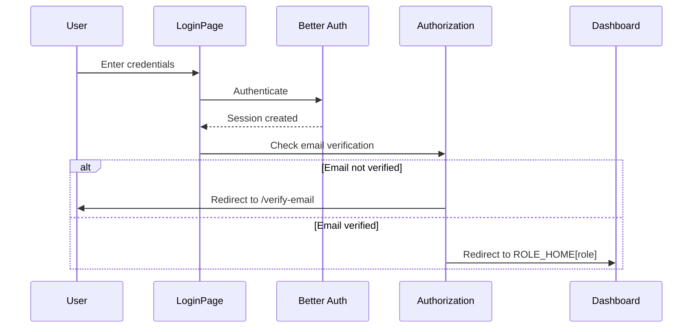
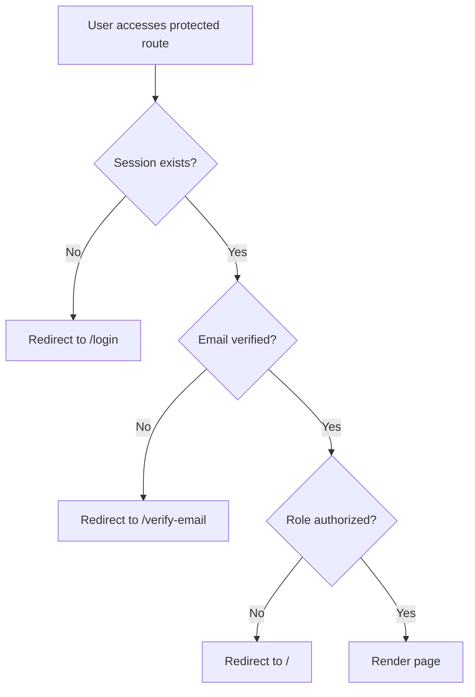

# Authorization Documentation

This document provides comprehensive documentation of the authorization middleware, role-based access control (RBAC), and authentication patterns used throughout the application.

## Overview

The application implements a robust role-based access control system with seven distinct user roles, each with specific permissions and access to different areas of the platform. Authorization is enforced through middleware functions that protect routes and ensure users can only access features appropriate to their role.

**Key Components:**
- **Authentication Layer:** Better Auth session management
- **Authorization Middleware:** Role-based route protection (`lib/authz.ts`)
- **Role Hierarchy:** 7 roles from super admin to career applicant
- **Home Route Mapping:** Automatic role-based dashboard redirection
- **Email Verification:** Required before accessing protected routes

## User Roles

The application supports seven distinct user roles, defined in the database schema:

| Role | Identifier | Description | Primary Dashboard |
|------|------------|-------------|-------------------|
| **Super Admin** | `super_admin` | Full system access, manage all users, settings, and data | `/admin` |
| **Admin** | `admin` | Administrative access to participants, exams, results, payments | `/admin` |
| **Coordinator** | `coordinator` | Regional coordinator managing participants in their area | `/coordinator` |
| **Participant** | `participant` | Students enrolled in assessment program | `/participant` |
| **Partner Contact** | `partner_contact` | Partner organization representative | `/partner` |
| **Career Applicant** | `career_applicant` | Job applicant with limited access | `/` |
| **Question Provider** | `question_provider` | External question content provider | `/qp` |

### Role Hierarchy

```
super_admin (highest privileges)
  ├── admin
  ├── coordinator
  ├── question_provider
  ├── partner_contact
  ├── participant
  └── career_applicant (lowest privileges)
```

**Staff Roles:** `super_admin`, `admin`, `coordinator` are considered "staff" roles with access to administrative features.

## Authorization Functions

All authorization functions are defined in `lib/authz.ts` and use Next.js server-side rendering for secure, server-only authorization checks.

### 1. `getCurrentSession()`

Retrieves the current user session without requiring authentication.

```typescript
export async function getCurrentSession() {
  return auth.api.getSession({ headers: await headers() });
}
```

**Usage:**
- Optional authentication checks
- Personalizing content for logged-in users
- Conditional UI rendering based on user status

**Returns:**
- `Session` object if user is logged in
- `null` if no active session

**Example:**
```typescript
// Marketing page with optional personalization
export default async function HomePage() {
  const session = await getCurrentSession();
  
  return (
    <div>
      {session ? (
        <Link href={ROLE_HOME[session.user.role]}>Go to Dashboard</Link>
      ) : (
        <Link href="/login">Login</Link>
      )}
    </div>
  );
}
```

### 2. `requireSession()`

Enforces authentication and email verification before allowing access.

```typescript
export async function requireSession() {
  const session = await getCurrentSession();
  if (!session) redirect("/login");
  if (!session.user.emailVerified) {
    redirect(`/verify-email?email=${encodeURIComponent(session.user.email)}`);
  }
  return session;
}
```

**Usage:**
- Protect routes requiring any authenticated user
- Base-level authentication for dashboard layouts
- Ensure email verification before access

**Redirects:**
- `/login` if no session exists
- `/verify-email?email=...` if email not verified

**Returns:** Verified `Session` object

**Example:**
```typescript
// Dashboard layout requiring authentication
export default async function DashboardLayout({ children }: { children: React.ReactNode }) {
  const session = await requireSession(); // Ensures user is logged in and verified
  const role = (session.user as { role?: string }).role ?? "participant";
  
  return (
    <div className="dashboard">
      <Sidebar role={role} />
      {children}
    </div>
  );
}
```

### 3. `requireRole()`

Enforces role-based access control, allowing only specific roles to access a route.

```typescript
export async function requireRole(allowed: Role | Role[]) {
  const session = await requireSession();
  const allowedList = Array.isArray(allowed) ? allowed : [allowed];
  const role = (session.user as { role?: Role }).role ?? "participant";
  if (!allowedList.includes(role)) redirect("/");
  return session;
}
```

**Usage:**
- Protect routes requiring specific role(s)
- Implement fine-grained authorization
- Support both single role and multiple role authorization

**Parameters:**
- `allowed`: Single role string or array of role strings

**Redirects:**
- `/` (homepage) if user's role is not in the allowed list
- Also performs `requireSession()` checks (login + email verification)

**Returns:** Verified `Session` object with authorized role

**Example 1: Single Role**
```typescript
// Super admin only page
export default async function AnalyticsPage() {
  await requireRole(["super_admin"]);
  
  return <AnalyticsDashboard />;
}
```

**Example 2: Multiple Roles**
```typescript
// Admin or super_admin access
export default async function ExamsPage() {
  await requireRole(["admin", "super_admin"]);
  
  const exams = await db.query.exams.findMany();
  return <ExamsList exams={exams} />;
}
```

**Example 3: Cross-Role Access**
```typescript
// Partner page accessible by partner contacts and admins
export default async function PartnerProfilePage() {
  const session = await requireRole(["partner_contact", "admin", "super_admin"]);
  const userId = session.user.id;
  
  const partnerData = await db.query.partners.findFirst({
    where: eq(partners.userId, userId)
  });
  
  return <PartnerProfile data={partnerData} />;
}
```

### 4. `requireStaffSession()`

Enforces staff-only access, restricting routes to administrative roles.

```typescript
export async function requireStaffSession() {
  const session = await getCurrentSession();
  if (!session) redirect("/staff");
  const role = (session.user as { role?: Role }).role ?? "participant";
  const staffRoles: Role[] = ["super_admin", "admin", "coordinator"];
  if (!staffRoles.includes(role)) redirect("/");
  return session;
}
```

**Usage:**
- Protect staff-only features and portals
- Enforce administrative access requirements
- Alternative to `requireRole(["super_admin", "admin", "coordinator"])`

**Staff Roles:** `super_admin`, `admin`, `coordinator`

**Redirects:**
- `/staff` if no session exists (staff login portal)
- `/` (homepage) if user is not a staff member

**Returns:** Verified `Session` object with staff role

**Example:**
```typescript
// Staff portal dashboard
export default async function StaffDashboard() {
  const session = await requireStaffSession();
  
  return <StaffOverview session={session} />;
}
```

## ROLE_HOME Mapping

The `ROLE_HOME` constant maps each role to its default dashboard route, used for post-login redirection and navigation.

```typescript
export const ROLE_HOME: Record<Role, string> = {
  super_admin: "/admin",
  admin: "/admin",
  coordinator: "/coordinator",
  participant: "/participant",
  partner_contact: "/partner",
  career_applicant: "/",
  question_provider: "/qp",
};
```

### Usage Patterns

**1. Post-Login Redirection**
```typescript
// After successful login
const role = session.user.role;
const homeRoute = ROLE_HOME[role];
redirect(homeRoute);
```

**2. Staff Portal Auto-Redirect**
```typescript
// Staff page redirects authenticated staff to their dashboard
export default async function StaffPage() {
  const session = await getCurrentSession();
  if (session?.user) {
    const role = (session.user as { role?: string }).role ?? "";
    const dest = ROLE_HOME[role as keyof typeof ROLE_HOME];
    if (dest && role !== "participant") redirect(dest);
  }
  
  return <StaffLoginForm />;
}
```

**3. Conditional Navigation**
```typescript
// Navigation header with role-based links
export function Header({ session }: { session: Session | null }) {
  if (!session) return <LoginButton />;
  
  const role = session.user.role;
  const dashboardLink = ROLE_HOME[role];
  
  return <Link href={dashboardLink}>My Dashboard</Link>;
}
```

## Authorization Patterns

### Pattern 1: Layout-Level Authorization

Protect entire route groups by adding authorization to the layout component:

```typescript
// app/(dashboard)/layout.tsx
export default async function DashboardLayout({ children }: { children: React.ReactNode }) {
  const session = await requireSession(); // All dashboard routes require authentication
  const role = (session.user as { role?: Role }).role ?? "participant";
  
  return (
    <DashboardShell role={role}>
      {children}
    </DashboardShell>
  );
}
```

### Pattern 2: Page-Level Authorization

Add specific role requirements to individual pages:

```typescript
// app/(dashboard)/admin/users/page.tsx
export default async function UsersPage() {
  await requireRole(["super_admin"]); // Only super_admin can manage users
  
  const users = await db.query.users.findMany();
  return <UsersTable users={users} />;
}
```

### Pattern 3: Data-Scoped Authorization

Retrieve session data to scope queries to the current user:

```typescript
// app/(dashboard)/participant/results/page.tsx
export default async function ResultsPage() {
  const session = await requireRole(["participant", "admin", "super_admin"]);
  const userId = session.user.id;
  const isAdmin = ["admin", "super_admin"].includes(session.user.role);
  
  // Participants see only their results, admins see all results
  const results = isAdmin
    ? await db.query.examSessions.findMany()
    : await db.query.examSessions.findMany({
        where: eq(examSessions.userId, userId)
      });
  
  return <ResultsList results={results} />;
}
```

### Pattern 4: Nested Route Protection

Use both layout and page authorization for defense in depth:

```typescript
// app/(dashboard)/admin/layout.tsx
export default async function AdminLayout({ children }: { children: React.ReactNode }) {
  await requireRole(["admin", "super_admin"]); // All admin routes require admin or super_admin
  return <AdminShell>{children}</AdminShell>;
}

// app/(dashboard)/admin/settings/page.tsx
export default async function SettingsPage() {
  await requireRole(["super_admin"]); // Settings page is super_admin only
  return <SystemSettings />;
}
```

## Authentication Flow

### User Login Flow



### Authorization Check Flow



## Security Best Practices

### 1. Server-Side Authorization Only

**❌ Never rely on client-side authorization:**
```typescript
// WRONG - Client can manipulate this
"use client";
export default function AdminPage() {
  const { session } = useSession();
  if (session?.user.role !== "admin") return <AccessDenied />;
  return <AdminPanel />;
}
```

**✅ Always use server-side authorization:**
```typescript
// CORRECT - Server-side enforcement
export default async function AdminPage() {
  await requireRole(["admin", "super_admin"]);
  return <AdminPanel />;
}
```

### 2. Defense in Depth

Implement authorization at multiple levels:

1. **Layout Level:** Protect route groups
2. **Page Level:** Protect individual pages
3. **Server Action Level:** Protect data mutations
4. **Database Query Level:** Scope data access

```typescript
// Server action with authorization
"use server";
export async function deleteUser(userId: string) {
  const session = await requireRole(["super_admin"]); // Authorization check
  
  await db.delete(users).where(eq(users.id, userId));
  revalidatePath("/admin/users");
}
```

### 3. Fail Securely

Always default to denying access:

```typescript
// Good: Defaults to "participant" if role is missing
const role = (session.user as { role?: Role }).role ?? "participant";
```

### 4. Email Verification Enforcement

Always verify email before granting access to protected routes (handled automatically by `requireSession()` and `requireRole()`).

### 5. Audit Logging

For sensitive operations, log authorization decisions:

```typescript
export async function promoteToAdmin(userId: string) {
  const session = await requireRole(["super_admin"]);
  
  await db.insert(auditLogs).values({
    action: "user_role_change",
    performedBy: session.user.id,
    targetUserId: userId,
    timestamp: new Date(),
  });
  
  await db.update(users).set({ role: "admin" }).where(eq(users.id, userId));
}
```

## Common Authorization Scenarios

### Scenario 1: Public Marketing Pages

No authorization required, optional session for personalization:

```typescript
export default async function AboutPage() {
  const session = await getCurrentSession(); // Optional
  return <AboutContent session={session} />;
}
```

### Scenario 2: Any Authenticated User

Require login and email verification:

```typescript
export default async function ProfilePage() {
  const session = await requireSession();
  return <UserProfile user={session.user} />;
}
```

### Scenario 3: Single Role Only

Restrict to one specific role:

```typescript
export default async function SuperAdminSettings() {
  await requireRole(["super_admin"]);
  return <SystemSettings />;
}
```

### Scenario 4: Multiple Roles

Allow access from multiple roles:

```typescript
export default async function ExamManagement() {
  await requireRole(["admin", "super_admin"]);
  return <ExamManager />;
}
```

### Scenario 5: Staff Only

Allow any staff member (admin, super_admin, coordinator):

```typescript
export default async function StaffDashboard() {
  await requireStaffSession();
  return <StaffOverview />;
}
```

### Scenario 6: Conditional Access Based on User Data

Access decision based on user's data, not just role:

```typescript
export default async function PartnerDashboard() {
  const session = await requireRole(["partner_contact", "admin", "super_admin"]);
  
  // Partner contacts can only see their own data
  const isPartner = session.user.role === "partner_contact";
  const partnerId = isPartner ? session.user.id : null;
  
  const data = await fetchPartnerData(partnerId); // null means all partners (admin view)
  return <PartnerDashboard data={data} />;
}
```

## Role-Based Route Summary

| Route Group | Path Pattern | Authorization Function | Allowed Roles |
|-------------|--------------|------------------------|---------------|
| Auth | `/(auth)/*` | None (public) | All users (unauthenticated) |
| Marketing | `/(marketing)/*` | `getCurrentSession()` (optional) | All users |
| Admin | `/admin/*` | `requireRole(["admin", "super_admin"])` | `admin`, `super_admin` |
| Admin (restricted) | `/admin/users`, `/admin/settings`, etc. | `requireRole(["super_admin"])` | `super_admin` only |
| Coordinator | `/coordinator/*` | `requireRole(["coordinator"])` | `coordinator` |
| Participant | `/participant/*` | `requireRole(["participant", "admin", "super_admin"])` | `participant` + admins |
| Partner | `/partner/*` | `requireRole(["partner_contact", "admin", "super_admin"])` | `partner_contact` + admins |
| Question Provider | `/qp/*` | `requireRole(["question_provider"])` | `question_provider` |
| Staff Portal | `/staff` | Custom logic (see `/app/staff/page.tsx`) | Staff roles redirect to dashboard |

## Testing Authorization

### Manual Testing Checklist

- [ ] Unauthenticated users cannot access protected routes
- [ ] Authenticated users without email verification are redirected to `/verify-email`
- [ ] Users are redirected to appropriate dashboard based on role (ROLE_HOME)
- [ ] Users cannot access routes for roles they don't have
- [ ] Admins can access participant/partner pages (cross-role access)
- [ ] Super admin has access to all admin pages
- [ ] Regular admin cannot access super_admin-only pages (users, settings, analytics)
- [ ] Staff login portal redirects authenticated staff to their dashboard

### Test User Roles

Create test accounts for each role to verify authorization:

```sql
-- Example test users (passwords should be properly hashed)
INSERT INTO users (email, role, email_verified) VALUES
  ('superadmin@test.com', 'super_admin', true),
  ('admin@test.com', 'admin', true),
  ('coordinator@test.com', 'coordinator', true),
  ('participant@test.com', 'participant', true),
  ('partner@test.com', 'partner_contact', true),
  ('qp@test.com', 'question_provider', true),
  ('applicant@test.com', 'career_applicant', true);
```

## Related Documentation

- [Route Mapping](./ROUTE_MAPPING.md) - Complete list of all routes and their role mappings
- [Database Schema](./DATABASE.md) - User and session table schemas
- [Data Flow](./DATA_FLOW.md) - How authorization integrates with server actions

## Reference Files

- **Authorization Library:** `lib/authz.ts`
- **Database Schema:** `lib/db/schema.ts` (role enum definition)
- **Auth Configuration:** `lib/auth.ts` (Better Auth setup)
- **Dashboard Layout:** `app/(dashboard)/layout.tsx` (uses `requireSession()`)

---

*Last updated: 2026-05-10*
