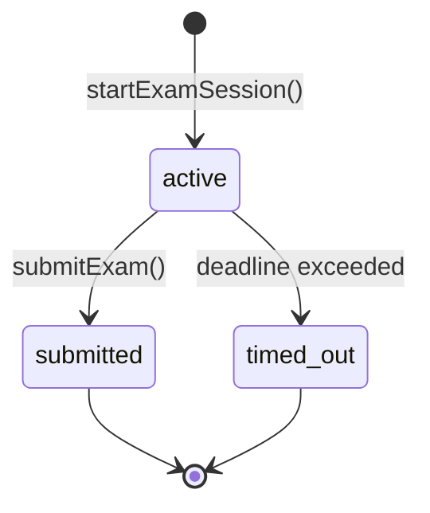

# Exam Lifecycle Documentation

This document describes the complete lifecycle of an examination in the GATE Platform, from creation through grading and results publication.

## Overview

The exam lifecycle consists of 9 distinct stages that cover the entire journey of an examination from conception to completion:

1. **Exam Creation** - Initial exam setup by authorized users
2. **Question Management** - Adding and organizing exam questions
3. **Exam Configuration** - Configuring exam parameters and constraints
4. **Publishing** - Making the exam available to participants
5. **Session Start** - Participant begins an exam attempt
6. **Answering Questions** - Participant responds to exam questions
7. **Submission** - Participant completes and submits the exam
8. **Auto-Grading** - System automatically scores objective questions
9. **Manual Grading** - Administrative review and scoring of open-ended questions

## Database Schema Context

The exam system follows this hierarchical structure:

```
cycles
  └── rounds
        └── exams
              └── questions
                    └── exam_sessions (participant attempts)
                          └── exam_answers (individual question responses)
```

### Core Tables

- **exams** - Exam definitions and configuration
- **questions** - Individual questions within an exam
- **exam_sessions** - Participant exam attempts
- **exam_answers** - Individual question responses within a session

---

## Exam Session Flow Sequence Diagram

The following Mermaid diagram illustrates the complete flow of an exam session from start to submission, showing the interactions between the participant, system, and database:

```mermaid
sequenceDiagram
    participant P as Participant
    participant S as System
    participant DB as Database

    Note over P,DB: Stage 5: Session Start

    P->>S: Start Exam (examId)
    S->>DB: Query exam (published, windowStart, windowEnd)
    DB-->>S: Return exam + questions
    
    alt Exam not available
        S-->>P: Error: "Exam not available"
    else Exam window not active
        S-->>P: Error: "Window not started/closed"
    else Exam available
        S->>DB: Query participant (userId, grade, enrollments)
        DB-->>S: Return participant profile
        
        alt Participant not found
            S-->>P: Error: "Participant profile not found"
        else Not enrolled (participants only)
            S-->>P: Error: "Not enrolled in round/subject"
        else Participant eligible
            S->>DB: Query existing sessions (non-archived)
            DB-->>S: Return existing session (if any)
            
            alt Active session exists
                S-->>P: Resume session (sessionId)
            else Completed exam (type="exam")
                S-->>P: Error: "Already completed this exam"
            else Completed practice (type="practice")
                S->>DB: Archive previous session (archivedAt)
                DB-->>S: Session archived
                S->>S: Filter questions by grade
                S->>S: Shuffle questions (if enabled)
                S->>S: Limit questions (if configured)
                S->>S: Calculate deadline (if durationMinutes set)
                S->>DB: Insert exam_sessions (questionOrder, deadlineAt)
                DB-->>S: Return new sessionId
                S-->>P: Session created (sessionId)
            else No prior session
                S->>S: Filter questions by grade
                S->>S: Shuffle questions (if enabled)
                S->>S: Limit questions (if configured)
                S->>S: Calculate deadline (if durationMinutes set)
                S->>DB: Insert exam_sessions (questionOrder, deadlineAt)
                DB-->>S: Return new sessionId
                S-->>P: Session created (sessionId)
            end
        end
    end

    Note over P,DB: Stage 6: Answering Questions

    loop For each question
        P->>S: Save Answer (sessionId, questionId, answer, flagged)
        S->>DB: Query exam_sessions (status, deadlineAt, participantId)
        DB-->>S: Return session
        
        alt Session not active
            S-->>P: Error: "Session not active"
        else Ownership mismatch (participants only)
            S-->>P: Error: "Unauthorized"
        else Deadline exceeded
            S->>DB: Update exam_sessions (status="timed_out")
            DB-->>S: Session timed out
            S-->>P: Error: "Time expired"
        else Valid save
            S->>DB: Upsert exam_answers (answer, flagged, answeredAt)
            DB-->>S: Answer saved
            S-->>P: Answer saved successfully
        end
    end

    Note over P,DB: Optional: Tab Switch Detection
    
    loop During active session
        P->>S: Log Tab Switch (sessionId)
        S->>DB: Increment tabSwitchCount (only if status="active")
        DB-->>S: Count updated
    end

    Note over P,DB: Stage 7: Submission

    P->>S: Submit Exam (sessionId)
    S->>DB: Query session with answers and questions
    DB-->>S: Return session data
    
    alt Session not active
        S-->>P: Error: "Session not active"
    else Session active
        S->>S: Filter questions by session.questionOrder
        
        Note over S: Stage 8: Auto-Grading
        
        loop For each question in session
            alt Question type = MCQ
                S->>S: isCorrect = (answer == correctAnswer)
                S->>S: pointsAwarded = isCorrect ? points : 0
            else Question type = numeric
                S->>S: diff = abs(answer - correctAnswer)
                S->>S: isCorrect = (diff < 1e-9)
                S->>S: pointsAwarded = isCorrect ? points : 0
            else Question type = open
                S->>S: Skip (manual grading required)
            end
        end
        
        S->>S: Calculate score = (earnedPoints / totalPoints) * 100
        
        S->>DB: Batch update exam_answers (isCorrect, pointsAwarded)
        DB-->>S: Answers graded
        
        S->>DB: Update exam_sessions (status="submitted", submittedAt, score)
        DB-->>S: Session submitted
        
        S-->>P: Submission successful (score)
    end

    Note over P,DB: Stage 9: Manual Grading (Admin)

    opt If open-ended questions exist
        S->>DB: Query ungraded answers (type="open")
        DB-->>S: Return open answers
        Note over S: Admin reviews and grades manually
        S->>DB: Update exam_answers (isCorrect, pointsAwarded, gradedAt, gradedByUserId)
        DB-->>S: Answer graded
        S->>DB: Query all answers for session
        DB-->>S: Return all answers
        S->>S: Recalculate score (includes new open question points)
        S->>DB: Update exam_sessions (score)
        DB-->>S: Score updated
    end
```



### Key Interactions

**Session Creation:**
- Validates exam availability, time windows, and participant eligibility
- Enforces enrollment requirements (round, subject) for participants
- Archives prior practice sessions without deletion
- Filters, shuffles, and limits questions based on configuration
- Calculates deadline from durationMinutes

**Answer Saving:**
- Enforces ownership (participants can only save to their own sessions)
- Checks deadline on every save and auto-timeouts if expired
- Uses upsert logic (insert or update) for answer persistence
- Preserves answeredAt timestamp only when answer is provided

**Tab Switch Tracking:**
- Incremental counter updated via SQL to avoid race conditions
- Only tracked for active sessions
- Participants can only log for their own sessions

**Submission & Auto-Grading:**
- Only grades questions in session.questionOrder (respects shuffle/limit)
- MCQ: Exact string match with correctAnswer
- Numeric: Tolerance of 1e-9 for floating-point precision
- Open: Skipped during auto-grading, requires manual review
- Score calculated as percentage of earned vs total points

**Manual Grading:**
- Admins grade open-ended questions post-submission
- Each graded answer triggers full session score recalculation
- Supports partial credit (pointsAwarded < question.points)
- Audit trail via gradedAt and gradedByUserId

---

## Stage 1: Exam Creation

**Responsible Roles:** `admin`, `super_admin`, `question_provider`

**Action:** `createExam` (lib/actions/exam.ts)

### Process

Authorized users create a new exam with initial configuration:

```typescript
// Required fields
- title: string
- type: "exam" | "practice"
- createdByUserId: string (automatically set)

// Optional fields
- subjectId: integer (links to a specific subject)
- roundId: integer (links to a competition round)
- durationMinutes: integer
- windowStart: timestamp
- windowEnd: timestamp
- shuffleQuestions: boolean (default: true)
- questionsPerSession: integer (limits question count)
- instructions: text
```

### Key Rules

1. **Ownership:** Question providers can only manage exams they created
2. **Initial State:** Exams are created unpublished (`published: false`)
3. **Type Distinction:**
   - **exam**: Official assessment, one attempt per participant
   - **practice**: Training mode, allows multiple attempts (prior sessions archived)

### Database State

```sql
INSERT INTO exams (
  title, type, createdByUserId, subjectId, roundId,
  durationMinutes, windowStart, windowEnd,
  shuffleQuestions, questionsPerSession, instructions
) VALUES (...)
```

---

## Stage 2: Question Management

**Responsible Roles:** `admin`, `super_admin`, `question_provider`

**Actions:** `createQuestion`, `updateQuestion`, `deleteQuestion`

### Question Types

1. **MCQ (Multiple Choice)**
   - `type: "mcq"`
   - Requires `options` (JSON array) and `correctAnswer`
   - Auto-gradable

2. **Numeric**
   - `type: "numeric"`
   - Requires `correctAnswer` (numeric value)
   - Auto-gradable with tolerance (< 1e-9)

3. **Open-Ended**
   - `type: "open"`
   - No correct answer predefined
   - Requires manual grading

### Question Schema

```typescript
{
  examId: integer (FK to exams)
  type: "mcq" | "numeric" | "open"
  content: text (question text)
  options: jsonb (for MCQ only)
  correctAnswer: text (for MCQ/numeric)
  grades: text[] (target grade levels, e.g., ["9", "10"])
  points: integer (default: 1)
  explanation: text (shown after grading)
  order: integer (display sequence)
}
```

### Key Operations

**Creating Questions:**
- Questions are automatically ordered (incremental from max existing order)
- Grade filtering allows targeting specific participant grade levels
- Empty `grades` array = question available to all grades

**Updating Questions:**
- Ownership verification for question providers
- Full update of all question fields
- Path revalidation for admin and QP interfaces

**Deleting Questions:**
- **Constraint:** Cannot delete if any participant has answered it
- Audit log entry created
- Cascade deletion handled by database

### Validation Rules

1. Question content is required
2. MCQ questions must have valid JSON options array
3. Question providers can only modify questions in exams they own
4. Deletion blocked if answers exist

---

## Stage 3: Exam Configuration

**Responsible Roles:** `admin`, `super_admin`

**Action:** `updateExam`

### Configurable Parameters

**Timing Controls:**
```typescript
durationMinutes: integer  // Session time limit (null = no limit)
windowStart: timestamp    // Earliest start time
windowEnd: timestamp      // Latest submission time
```

**Question Behavior:**
```typescript
shuffleQuestions: boolean        // Randomize question order
questionsPerSession: integer     // Limit questions per attempt
targetGrades: text[]             // Grade levels eligible for exam
```

**Organizational:**
```typescript
title: string
type: "exam" | "practice"
subjectId: integer      // Required subject enrollment
roundId: integer        // Required round enrollment
instructions: text      // Participant-facing guidance
```

### Configuration Logic

1. **Grade Targeting:** Both exam-level and question-level grade filters apply
2. **Time Windows:** Enforced at session start
3. **Shuffle + Limit:** Questions shuffled first, then sliced if limit set
4. **Subject/Round Enforcement:** Checked during session start (Stage 5)

---

## Stage 4: Publishing

**Responsible Roles:** `admin`, `super_admin`

**Action:** `togglePublishExam`

### Process

Publishing is a boolean toggle operation:

```typescript
published: false → true  // Makes exam available to participants
published: true → false  // Hides exam from participants
```

### Visibility Rules

1. **Unpublished:** Only admins can see the exam
2. **Published:** Participants can discover and start exam sessions
3. **Session Start Check:** `if (!exam || !exam.published) return { error: "Exam not available" }`

### State Transitions

- Publishing does NOT validate that questions exist
- Can be toggled multiple times
- Does not affect existing sessions (only new session starts)

---

## Stage 5: Session Start

**Responsible Roles:** `participant`, `admin`, `super_admin`

**Action:** `startExamSession`

### Eligibility Checks

The system performs comprehensive validation before creating a session:

**1. Exam Availability:**
```typescript
- Exam exists and is published
- Current time is within exam window (windowStart to windowEnd)
```

**2. Participant Enrollment (participants only, admins bypass):**
```typescript
- Participant profile exists
- Enrolled in exam's round (if roundId specified)
- Enrolled in exam's subject (if subjectId specified)
```

**3. Prior Attempts:**
```typescript
- For "exam" type: No completed session exists
- For "practice" type: Archive prior session, allow new attempt
```

**4. Question Availability:**
```typescript
- Filter questions by participant's grade level
- Ensure at least one question matches participant's grade
```

### Session Creation Logic

```typescript
// 1. Filter questions by grade
const gradeFiltered = questions.filter(q => 
  q.grades.length === 0 || q.grades.includes(participantGrade)
)

// 2. Shuffle if configured
if (exam.shuffleQuestions) {
  questionIds = shuffle(questionIds)
}

// 3. Limit if configured
if (exam.questionsPerSession) {
  questionIds = questionIds.slice(0, exam.questionsPerSession)
}

// 4. Calculate deadline
const deadlineAt = exam.durationMinutes 
  ? now + (durationMinutes * 60 * 1000)
  : null

// 5. Create session
INSERT INTO exam_sessions (
  examId, participantId, questionOrder, 
  deadlineAt, status: "active"
)
```

### Session Schema

```typescript
{
  id: serial
  examId: integer (FK)
  participantId: integer (FK)
  questionOrder: number[] (JSONB - shuffled/limited question IDs)
  startedAt: timestamp (auto)
  deadlineAt: timestamp (calculated from durationMinutes)
  submittedAt: timestamp (null until submission)
  status: "active" | "submitted" | "timed_out"
  score: numeric (null until grading)
  tabSwitchCount: integer (proctoring metric)
  ipAddress: text
  userAgent: text
  archivedAt: timestamp (for practice exam history)
}
```

### Error Scenarios

- `"Exam not available"` - Not published or doesn't exist
- `"Exam window has not started"` - Before windowStart
- `"Exam window has closed"` - After windowEnd
- `"Participant profile not found"` - No participant record
- `"You are not enrolled in the round for this exam"` - Round mismatch
- `"You are not enrolled in the subject for this exam"` - Subject mismatch
- `"You have already completed this exam"` - Prior exam attempt exists
- `"No questions match Grade X"` - No questions for participant's grade

---

## Stage 6: Answering Questions

**Responsible Roles:** `participant`, `admin`, `super_admin`

**Action:** `saveAnswer`

### Process

Participants save answers progressively during an active session:

```typescript
saveAnswer(
  sessionId: number,
  questionId: number,
  answer: string | null,
  flagged: boolean = false
)
```

### Validation Rules

**1. Session Status:**
```typescript
- Session must exist and have status: "active"
- Participants can only save to their own sessions
- Admins can save to any session
```

**2. Time Enforcement:**
```typescript
if (deadlineAt && now > deadlineAt) {
  // Auto-timeout session
  UPDATE exam_sessions SET status = "timed_out"
  return { error: "Time expired" }
}
```

**3. Ownership Verification:**
```typescript
// Participants: session.participantId must match their participant record
// Admins: No restriction
```

### Answer Storage

Answers use upsert logic (insert or update on conflict):

```typescript
INSERT INTO exam_answers (
  sessionId, questionId, answer, flagged, answeredAt
) 
ON CONFLICT (sessionId, questionId) 
DO UPDATE SET
  answer = EXCLUDED.answer,
  flagged = EXCLUDED.flagged,
  answeredAt = CASE 
    WHEN EXCLUDED.answer IS NOT NULL THEN NOW()
    ELSE exam_answers.answeredAt
  END
```

### Answer Schema

```typescript
{
  id: serial
  sessionId: integer (FK)
  questionId: integer (FK)
  answer: text (participant's response)
  isCorrect: boolean (null until grading)
  pointsAwarded: numeric (null until grading)
  flagged: boolean (participant marked for review)
  answeredAt: timestamp (when answer provided)
  gradedAt: timestamp (when graded)
  gradedByUserId: text (admin who graded, for open questions)
}
```

### Key Features

1. **Progressive Saving:** Each answer saved independently
2. **Flagging:** Participants can mark questions for later review
3. **Null Answers:** Can save null to "unanswer" a question
4. **Timestamp Preservation:** `answeredAt` only updates when non-null answer provided

---

## Stage 7: Submission

**Responsible Roles:** `participant`, `admin`, `super_admin`

**Action:** `submitExam`

### Process

Submission finalizes the exam session and triggers auto-grading:

```typescript
submitExam(sessionId: number)
```

### Validation

1. Session exists and status is `"active"`
2. No validation on answer completeness (partial submissions allowed)

### Submission Workflow

**1. Load Session Data:**
```typescript
// Get session with all answers and questions
const session = await db.query.examSessions.findFirst({
  where: eq(examSessions.id, sessionId),
  with: {
    answers: { with: { question: true } },
    exam: { with: { questions: true } }
  }
})
```

**2. Filter Session Questions:**
```typescript
// Only grade questions assigned to THIS session
const sessionQuestionIds = new Set(session.questionOrder)
const sessionQuestions = exam.questions.filter(q => 
  sessionQuestionIds.has(q.id)
)
```

**3. Auto-Grade (See Stage 8):**
- MCQ and numeric questions scored automatically
- Open questions left ungraded (require manual review)

**4. Calculate Score:**
```typescript
const score = totalPoints > 0 
  ? ((earnedPoints / totalPoints) * 100).toFixed(2)
  : null
```

**5. Update Session:**
```typescript
UPDATE exam_sessions SET
  status = "submitted",
  submittedAt = NOW(),
  score = calculatedScore
WHERE id = sessionId
```

### State Transitions

```
active → submitted (normal submission)
active → timed_out (deadline exceeded during answer save)
```

**Note:** Timed-out sessions do NOT auto-submit. They remain in `timed_out` status.

---

## Stage 8: Auto-Grading

**Trigger:** Automatic during submission (Stage 7)

**Scope:** MCQ and numeric questions only

### Grading Logic

**MCQ Questions:**
```typescript
isCorrect = (answer === question.correctAnswer)
pointsAwarded = isCorrect ? question.points : 0
```

**Numeric Questions:**
```typescript
const diff = Math.abs(
  parseFloat(answer) - parseFloat(question.correctAnswer)
)
isCorrect = (diff < 1e-9)  // Tolerance for floating-point precision
pointsAwarded = isCorrect ? question.points : 0
```

**Open Questions:**
```typescript
// Skipped during auto-grading
isCorrect = null
pointsAwarded = null
gradedAt = null
```

### Batch Update

All auto-gradable answers updated in parallel:

```typescript
await Promise.all(
  scoreUpdates.map(({ answerId, isCorrect, awarded }) =>
    db.update(examAnswers)
      .set({ isCorrect, pointsAwarded: awarded.toString() })
      .where(eq(examAnswers.id, answerId))
  )
)
```

### Score Calculation

```typescript
// Only count questions in session.questionOrder
totalPoints = sum(sessionQuestions.map(q => q.points))
earnedPoints = sum(gradedAnswers.map(a => a.pointsAwarded))
score = (earnedPoints / totalPoints) * 100
```

**Important:** Score is calculated from both auto-graded and manually graded questions. Initially, open questions contribute 0 points.

---

## Stage 9: Manual Grading

**Responsible Roles:** `admin`, `super_admin`

**Action:** `gradeOpenAnswer`

### Process

Administrators manually review and score open-ended questions:

```typescript
gradeOpenAnswer(
  answerId: number,
  isCorrect: boolean,
  pointsAwarded: number
)
```

### Grading Workflow

**1. Update Answer Record:**
```typescript
UPDATE exam_answers SET
  isCorrect = $isCorrect,
  pointsAwarded = $pointsAwarded,
  gradedAt = NOW(),
  gradedByUserId = $adminUserId
WHERE id = $answerId
```

**2. Recalculate Session Score:**

After grading each answer, the entire session score is recalculated:

```typescript
// 1. Load all answers for the session
const allAnswers = await db.query.examAnswers.findMany({
  where: eq(examAnswers.sessionId, answer.sessionId)
})

// 2. Get session questions
const sessionQuestions = exam.questions.filter(q => 
  sessionQuestionIds.has(q.id)
)

// 3. Calculate totals
const totalPts = sessionQuestions.reduce((sum, q) => 
  sum + q.points, 0
)
const earnedPts = allAnswers.reduce((sum, a) => 
  sum + (parseFloat(a.pointsAwarded ?? "0") || 0), 0
)

// 4. Update session score
const newScore = totalPts > 0 
  ? ((earnedPts / totalPts) * 100).toFixed(2)
  : null

UPDATE exam_sessions SET score = newScore
WHERE id = sessionId
```

**3. Path Revalidation:**
```typescript
revalidatePath(`/admin/exams/${examId}/results`)
revalidatePath(`/admin/exams/${examId}/results/${sessionId}`)
```

### Grading Interface

Admins access ungraded answers via:
- `/admin/exams/{examId}/results` - List all sessions
- `/admin/exams/{examId}/results/{sessionId}` - Individual session details

### Partial Scoring

The system supports partial credit:
```typescript
// Example: 5-point question, award 3 points
pointsAwarded: 3.0  // Not required to be 0 or question.points
```

### Audit Trail

Each graded answer records:
- `gradedAt`: Timestamp of grading
- `gradedByUserId`: Admin who performed the grading

---

## Exam Types Comparison

### Exam (Official Assessment)

```typescript
type: "exam"
```

- **Purpose:** Official evaluation
- **Attempts:** One per participant
- **Completion:** Status becomes `"submitted"`, no retries
- **Use Case:** Competition rounds, placement tests

### Practice (Training Mode)

```typescript
type: "practice"
```

- **Purpose:** Self-study and preparation
- **Attempts:** Unlimited
- **Completion:** Prior sessions archived (not deleted)
- **Archival:** Old session gets `archivedAt` timestamp
- **Use Case:** Practice exams, study materials

**Archive Logic:**
```typescript
if (exam.type === "practice" && existingSession) {
  // Don't delete, archive for participant's review history
  await db.update(examSessions)
    .set({ archivedAt: new Date() })
    .where(eq(examSessions.id, existingSession.id))
}
```

---

## Proctoring and Security

The GATE Platform implements multiple proctoring features to ensure exam integrity and provide administrators with tools to monitor participant behavior during assessments. These features work together to create a comprehensive proctoring system.

### Overview of Proctoring Features

The system tracks four primary categories of proctoring data:

1. **Tab-Switch Detection** - Monitors when participants leave the exam window
2. **Timed Sessions** - Enforces time limits and deadlines
3. **Question Shuffling** - Prevents answer sharing between participants
4. **IP/User Agent Tracking** - Records technical session metadata

---

### 1. Tab-Switch Detection

**Purpose:** Detect when participants navigate away from the exam, potentially accessing unauthorized resources.

**Action:** `logTabSwitch` (lib/actions/exam.ts)

**Implementation:**

Tab switches are logged via client-side event listeners that trigger when the exam window loses focus:

```typescript
// Client-side detection (triggered by visibility/blur events)
await logTabSwitch(sessionId)

// Server-side implementation
UPDATE exam_sessions 
SET tabSwitchCount = tabSwitchCount + 1
WHERE id = sessionId 
  AND status = "active"
  AND participantId = <current_participant>
```

**Technical Details:**

- **Counter:** Incremental integer stored in `exam_sessions.tabSwitchCount`
- **Default Value:** 0 (set at session creation)
- **Increment Logic:** Uses SQL increment to avoid race conditions
- **Access Control:** Participants can only log switches for their own sessions
- **Status Filtering:** Only tracked for `"active"` sessions (not after submission)

**Authorization Rules:**

```typescript
// Participants: ownership check enforced
if (role === "participant") {
  const participant = await db.query.participants.findFirst({
    where: (p, { eq }) => eq(p.userId, auth.user.id),
  });
  participantIdFilter = eq(examSessions.participantId, participant.id);
}

// Admins: can log for any session (for testing/troubleshooting)
```

**Database Schema:**

```typescript
exam_sessions {
  tabSwitchCount: integer NOT NULL DEFAULT 0
}
```

**Use Cases:**

1. **Integrity Review:** Admins review `tabSwitchCount` when grading to identify suspicious behavior
2. **Policy Enforcement:** High switch counts may trigger manual review
3. **Participant Awareness:** Visible counter discourages cheating attempts
4. **Historical Data:** Count preserved after submission for audit trails

**Limitations:**

- Relies on client-side events (can be bypassed with browser tools)
- Does not detect second devices or external resources
- Cannot distinguish between legitimate reasons (phone call) and cheating

**Best Practices:**

- Inform participants that switches are tracked (deterrent effect)
- Set reasonable thresholds (3-5 switches may be legitimate)
- Combine with other metrics (time taken, answer patterns)
- Do not auto-fail based solely on switch count

---

### 2. Timed Sessions

**Purpose:** Enforce time limits on exam attempts to ensure fair assessment conditions.

**Configuration:**

Timed sessions are configured at the exam level:

```typescript
// In exams table
durationMinutes: integer | null  // null = unlimited time
```

**Session Deadline Calculation:**

At session start, the system calculates a deadline if duration is set:

```typescript
// In startExamSession action
const now = new Date();
const deadlineAt = exam.durationMinutes
  ? new Date(now.getTime() + exam.durationMinutes * 60 * 1000)
  : null;

await db.insert(examSessions).values({
  examId,
  participantId: participant.id,
  questionOrder: questionIds,
  deadlineAt,  // Stored for enforcement
});
```

**Database Schema:**

```typescript
exam_sessions {
  startedAt: timestamp NOT NULL DEFAULT NOW()
  deadlineAt: timestamp | null
  status: enum("active" | "submitted" | "timed_out")
}
```

**Deadline Enforcement:**

Time limits are enforced on every answer save operation:

```typescript
// In saveAnswer action
const now = new Date();
if (dbSession.deadlineAt && now > dbSession.deadlineAt) {
  // Auto-timeout the session
  await db.update(examSessions)
    .set({ status: "timed_out" })
    .where(eq(examSessions.id, sessionId));
  
  return { error: "Time expired. Your session has been ended." };
}
```

**Status Transitions:**

```
┌─────────┐
│ active  │ ──────┐
└─────────┘       │
     │            │
     │ deadline   │ submitExam()
     │ exceeded   │
     ▼            ▼
┌───────────┐  ┌────────────┐
│ timed_out │  │ submitted  │
└───────────┘  └────────────┘
```

**Important Behaviors:**

1. **No Auto-Submit:** Timed-out sessions do NOT automatically submit
   - Status changes to `"timed_out"`
   - Further answer saves are blocked
   - Participant sees "Time expired" error
   - Requires manual administrative action to grade

2. **Continuous Enforcement:** Deadline checked on every `saveAnswer` call
   - Prevents late answer submissions
   - Works even if client-side timer fails
   - Server time is source of truth

3. **Grace Period:** None implemented
   - Deadline is absolute
   - Consider adding buffer in `durationMinutes` (e.g., 62 minutes for 60-minute exam)

**Configuration Recommendations:**

| Exam Type | Duration | Use Case |
|-----------|----------|----------|
| Practice | `null` | Unlimited time for self-paced learning |
| Short Quiz | 15-30 min | Quick assessments |
| Standard Exam | 60-120 min | Official evaluations |
| Competition Round | 180+ min | Multi-section competitions |

**Time Window vs Duration:**

```typescript
// Time window: when exam is available
windowStart: timestamp  // Earliest start time (e.g., 9:00 AM)
windowEnd: timestamp    // Latest submission time (e.g., 11:00 PM)

// Duration: session time limit
durationMinutes: integer  // How long participant has after starting
```

**Example Scenario:**

```typescript
exam {
  windowStart: "2024-01-15 09:00:00"  // Available from 9 AM
  windowEnd: "2024-01-15 23:00:00"    // Must finish by 11 PM
  durationMinutes: 120                // 2 hours per attempt
}

// Participant starts at 10:30 PM
startedAt: "2024-01-15 22:30:00"
deadlineAt: "2024-01-16 00:30:00"     // ⚠️ Exceeds windowEnd!

// System should validate: deadlineAt <= windowEnd
```

**⚠️ Current Limitation:** System does not validate that `deadlineAt <= windowEnd`. Consider adding this check.

---

### 3. Question Shuffling

**Purpose:** Prevent answer sharing by randomizing question order for each participant.

**Configuration:**

```typescript
// In exams table
shuffleQuestions: boolean DEFAULT true
questionsPerSession: integer | null  // Optional: limit total questions
```

**Shuffling Algorithm:**

Randomization occurs at session start, before storing question order:

```typescript
// In startExamSession action

// 1. Start with grade-filtered questions
let questionIds = gradeFiltered.map((q) => q.id);

// 2. Shuffle if enabled (Fisher-Yates-like shuffle)
if (exam.shuffleQuestions) {
  questionIds = questionIds.sort(() => Math.random() - 0.5);
}

// 3. Limit to subset if configured
if (exam.questionsPerSession && exam.questionsPerSession < questionIds.length) {
  questionIds = questionIds.slice(0, exam.questionsPerSession);
}

// 4. Store in session
await db.insert(examSessions).values({
  questionOrder: questionIds,  // JSONB array: [42, 15, 8, 23, ...]
});
```

**Database Schema:**

```typescript
exam_sessions {
  questionOrder: jsonb  // Stores: number[] (question IDs)
}
```

**Storage Format:**

```json
{
  "questionOrder": [42, 15, 8, 23, 91, 67, 34, 12, 55, 78]
}
```

**Why Store Order:**

1. **Consistency:** Participant sees same order if they refresh
2. **Grading:** System knows which questions to score
3. **Review:** Admins can see participant's exact question sequence
4. **Question Limiting:** When combined with `questionsPerSession`, ensures participant gets consistent subset

**Shuffle + Limit Interaction:**

```typescript
// Example: 50 questions in bank, 20 per session
questions.length = 50
questionsPerSession = 20
shuffleQuestions = true

// Result: Each participant gets random 20 questions
Participant A: [12, 45, 3, 8, ...]   // 20 IDs
Participant B: [33, 7, 41, 19, ...]  // Different 20 IDs
```

**Grading Implications:**

Only questions in `questionOrder` are scored:

```typescript
// In submitExam action
const sessionQuestionIds = new Set(session.questionOrder);
const sessionQuestions = exam.questions.filter(q => 
  sessionQuestionIds.has(q.id)
);

// Score calculation uses only sessionQuestions
const totalPoints = sessionQuestions.reduce((sum, q) => sum + q.points, 0);
```

**Security Benefits:**

1. **Answer Sharing Prevention:** Different question orders make copying harder
2. **Question Bank Rotation:** Random subsets prevent memorization
3. **Parallel Testing:** Multiple sessions can run simultaneously without concern
4. **Forensic Analysis:** Admins can detect collusion by comparing question orders

**Recommendations:**

| Exam Type | Shuffle | Limit | Rationale |
|-----------|---------|-------|-----------|
| Official Exam | ✅ Yes | Optional | Maximize security |
| Practice | ❌ No | No | Consistent learning experience |
| Quiz | ✅ Yes | 10-20 | Quick randomized checks |
| Large Bank | ✅ Yes | 30-50 | Draw from 100+ question pool |

**Disable Shuffling When:**

- Questions have logical dependencies (Q2 builds on Q1)
- Exam is narrative-based (reading passage followed by questions)
- Debugging/testing exam content
- Practice exams where learners expect consistent order

---

### 4. IP Address and User Agent Tracking

**Purpose:** Record technical session metadata for security auditing and anomaly detection.

**Database Schema:**

```typescript
exam_sessions {
  ipAddress: text | null    // IPv4/IPv6 address (e.g., "192.168.1.1")
  userAgent: text | null    // Browser identification string
}
```

**Captured Data:**

**IP Address:**
```
Examples:
- IPv4: "203.0.113.42"
- IPv6: "2001:db8::1"
- Proxy: "10.0.0.5" (internal network)
```

**User Agent:**
```
Examples:
- Chrome: "Mozilla/5.0 (Windows NT 10.0; Win64; x64) AppleWebKit/537.36 (KHTML, like Gecko) Chrome/91.0.4472.124 Safari/537.36"
- Firefox: "Mozilla/5.0 (X11; Linux x86_64; rv:89.0) Gecko/20100101 Firefox/89.0"
- Mobile: "Mozilla/5.0 (iPhone; CPU iPhone OS 14_6 like Mac OS X) AppleWebKit/605.1.15"
```

**Implementation Location:**

⚠️ **Current Status:** Schema fields exist but are not populated during session creation.

**Recommended Implementation:**

```typescript
// In startExamSession action - capture from request headers
import { headers } from "next/headers";

export async function startExamSession(examId: number) {
  // ... existing validation ...
  
  // Capture session metadata
  const headersList = headers();
  const ipAddress = headersList.get("x-forwarded-for")?.split(",")[0] 
                 || headersList.get("x-real-ip") 
                 || "unknown";
  const userAgent = headersList.get("user-agent") || "unknown";
  
  const [newSession] = await db.insert(examSessions).values({
    examId,
    participantId: participant.id,
    questionOrder: questionIds,
    deadlineAt,
    ipAddress,    // Store IP
    userAgent,    // Store browser info
  }).returning({ id: examSessions.id });
}
```

**Use Cases:**

1. **Multi-Device Detection:**
   - Flag if same participant uses different IPs mid-session
   - Identify proxy/VPN usage during exam

2. **Location Verification:**
   - Confirm participant is in expected location (onsite exams)
   - Detect geographic anomalies

3. **Device Consistency:**
   - Verify same browser/device used throughout session
   - Flag if user agent changes (potential impersonation)

4. **Forensic Investigation:**
   - Review technical details when cheating suspected
   - Correlate multiple accounts from same IP

5. **Statistical Analysis:**
   - Most common browsers/devices
   - Network infrastructure patterns

**Privacy Considerations:**

**Data Retention:**
- IP addresses are personal data under GDPR/privacy laws
- Document retention policy (e.g., delete after 90 days)
- Inform participants in privacy policy

**Anonymization:**
- Consider hashing IPs after initial validation period
- Truncate to network prefix (e.g., `192.168.1.xxx`)

**Access Control:**
- Only admins can view IP/user agent data
- Exclude from participant-facing session reviews

**Security Best Practices:**

1. **Proxy Detection:** IP may show CDN/proxy, not actual user
2. **Shared Networks:** School/library IPs shared by many users
3. **Dynamic IPs:** Home IPs may change during long exams
4. **Mobile Data:** Cellular IPs change frequently
5. **VPN Usage:** Consider policy on VPN usage during exams

**Admin Review Interface:**

Proctoring data should be visible in admin results views:

```typescript
// Example: /admin/exams/{examId}/results/{sessionId}
{
  participantName: "John Doe",
  score: "85.00",
  startedAt: "2024-01-15 10:30:00",
  submittedAt: "2024-01-15 11:45:00",
  
  // Proctoring metrics
  tabSwitchCount: 3,
  ipAddress: "203.0.113.42",
  userAgent: "Chrome 91 on Windows 10",
  
  // Analysis
  timeWarnings: [], // e.g., ["Submitted 5 min after deadline"]
  proctoringFlags: [] // e.g., ["High tab switch count", "IP changed mid-session"]
}
```

---

### Integrated Proctoring Workflow

**Session Creation (Stage 5):**
```typescript
1. Validate exam availability and participant eligibility
2. Shuffle questions if configured
3. Calculate deadline if duration set
4. ✅ Capture IP address and user agent
5. Create session with status: "active"
```

**Active Session (Stage 6):**
```typescript
1. Participant answers questions
2. ✅ Tab switches logged in real-time
3. ✅ Deadline checked on every answer save
4. Auto-timeout if time expired
```

**Submission (Stage 7):**
```typescript
1. Status: active → submitted
2. ✅ Tab switch count finalized
3. Auto-grading executed
4. Proctoring data preserved for review
```

**Admin Review (Stage 9):**
```typescript
1. Admin views session results
2. ✅ Reviews proctoring metrics:
   - Tab switch count
   - Session duration
   - IP/user agent consistency
   - Question order (shuffled)
3. Makes grading decisions with full context
```

---

### Proctoring Data Summary

| Feature | Field | Type | Captured When | Enforced When |
|---------|-------|------|---------------|---------------|
| **Tab Switches** | `tabSwitchCount` | integer | During session | Reviewed post-submission |
| **Time Limit** | `deadlineAt` | timestamp | Session start | Every answer save |
| **Question Order** | `questionOrder` | jsonb | Session start | Grading |
| **IP Address** | `ipAddress` | text | Session start | Reviewed post-submission |
| **User Agent** | `userAgent` | text | Session start | Reviewed post-submission |

---

### Limitations and Future Enhancements

**Current Limitations:**

1. **Client-Side Detection:** Tab switches rely on JavaScript events (can be bypassed)
2. **No Webcam:** No video proctoring capability
3. **No Screen Sharing:** Cannot monitor participant's screen
4. **Basic Time Tracking:** No pause/resume functionality
5. **IP Not Captured:** Schema exists but not implemented (requires addition)

**Potential Enhancements:**

1. **Advanced Proctoring:**
   - Webcam snapshots at intervals
   - AI-based behavior analysis
   - Screen recording (with consent)

2. **Improved Time Management:**
   - Pause/resume for technical issues
   - Time extensions for accommodations
   - Warning before deadline (5 min, 1 min)

3. **Enhanced Monitoring:**
   - Copy/paste detection
   - Right-click blocking
   - Full-screen enforcement
   - Browser lockdown integration

4. **Analytics Dashboard:**
   - Proctoring metrics across all sessions
   - Anomaly detection algorithms
   - Cheating pattern identification

5. **Network Security:**
   - IP geolocation validation
   - Device fingerprinting
   - Session token binding

**Recommendation:** Focus on creating a balanced approach that maintains exam integrity while respecting participant privacy and avoiding false positives.

---

## Question Ordering and Randomization

### Question Order Storage

Each session stores its question sequence:
```typescript
questionOrder: number[] // JSONB array of question IDs
```

### Ordering Logic

```typescript
// 1. Start with all grade-filtered questions
let questionIds = gradeFilteredQuestions.map(q => q.id)

// 2. Shuffle if enabled
if (exam.shuffleQuestions) {
  questionIds = questionIds.sort(() => Math.random() - 0.5)
}

// 3. Limit if configured
if (exam.questionsPerSession && exam.questionsPerSession < questionIds.length) {
  questionIds = questionIds.slice(0, exam.questionsPerSession)
}

// 4. Store in session
session.questionOrder = questionIds
```

### Grading Implications

Only questions in `session.questionOrder` are included in scoring:

```typescript
const sessionQIds = new Set(session.questionOrder)
const sessionQuestions = exam.questions.filter(q => 
  sessionQIds.has(q.id)
)
```

This ensures:
- Participants with different question sets graded fairly
- Question limit doesn't affect total point calculation
- Shuffling doesn't impact answer matching

---

## Grade-Level Filtering

### Two-Level Filtering

**1. Exam-Level:**
```typescript
exam.targetGrades: string[]  
// e.g., ["9", "10", "11"] or [] (all grades)
```

**2. Question-Level:**
```typescript
question.grades: string[]
// e.g., ["10", "11"] or [] (all grades)
```

### Filtering Logic

```typescript
// At session start
const participantGrade = participant.grade  // e.g., "10"

const gradeFiltered = exam.questions.filter(q => {
  const qGrades = q.grades ?? []
  return qGrades.length === 0 ||               // Question available to all
         (participantGrade && qGrades.includes(participantGrade))
})
```

### Empty Grades Array

- **Exam:** `targetGrades: []` = All participants eligible
- **Question:** `grades: []` = Available to all grades

### No Matching Questions

If filtering results in zero questions:
```typescript
return { 
  error: `No questions match Grade ${participantGrade}. 
          Ask an administrator to assign questions for your grade level.` 
}
```

---

## Session Status Lifecycle



### Status Definitions

**active:**
- Session in progress
- Participant can save/update answers
- Time enforcement active

**submitted:**
- Participant completed exam
- Auto-grading completed
- Manual grading may be pending
- Score may update as open questions graded

**timed_out:**
- Deadline exceeded during answer save
- Further answer saves blocked
- Session NOT auto-submitted
- Requires administrative action

---

## Score Calculation Details

### Initial Score (Stage 7)

Calculated at submission, includes only auto-graded questions:

```typescript
totalPoints = sum(sessionQuestions.points)
earnedPoints = sum(mcqPoints) + sum(numericPoints)  // Open = 0
score = (earnedPoints / totalPoints) * 100
```

### Updated Score (Stage 9)

Recalculated after each manual grading:

```typescript
totalPoints = sum(sessionQuestions.points)  // Unchanged
earnedPoints = sum(mcqPoints) + sum(numericPoints) + sum(openPoints)
score = (earnedPoints / totalPoints) * 100  // Higher as open questions graded
```

### Edge Cases

**No Questions:**
```typescript
score = null  // Avoid division by zero
```

**Partial Grading:**
- Score represents graded subset
- Updates as additional open answers graded
- Final score only after all questions graded

**Unanswered Questions:**
- Contribute 0 points to `earnedPoints`
- Still counted in `totalPoints`

---

## Admin vs Question Provider Permissions

### Question Providers

**Can:**
- Create exams (become automatic owner)
- Add/edit/delete questions in owned exams
- View owned exam details

**Cannot:**
- Modify exams created by others (unless claimed from legacy ownerless exams)
- Publish/unpublish exams
- Grade submissions
- Access admin grading interface

**Ownership Transfer:**
```typescript
// Legacy exams with createdByUserId = null
// First QP to access claims ownership
if (exam.createdByUserId === null) {
  exam.createdByUserId = currentQPUserId
}
```

### Admins/Super Admins

**Can:**
- Create/edit/delete any exam
- Publish/unpublish exams
- Add/edit/delete any questions
- Grade all submissions
- View all exam sessions and results
- Bypass enrollment checks when starting sessions

**No Restrictions:**
- Full access to all exam lifecycle stages
- No ownership validation

---

## Error Handling and Validation

### Common Validation Errors

**Exam Creation/Update:**
- `"Title is required"` - Missing title field

**Question Management:**
- `"Content is required"` - Missing question text
- `"Imtihon topilmadi"` - Exam not found (QP ownership check)
- `"Bu imtihonni boshqarish huquqingiz yo'q"` - Not exam owner
- `"Bu savolga participant javob bergan — o'chirib bo'lmaydi"` - Cannot delete answered question

**Session Start:**
- See Stage 5 error scenarios

**Answer Saving:**
- `"Session not active"` - Invalid session status
- `"Unauthorized"` - Session ownership mismatch
- `"Time expired"` - Deadline exceeded

**Submission:**
- `"Session not active"` - Cannot submit non-active session

### Path Revalidation

After mutations, UI caches are invalidated:

```typescript
// Exam CRUD
revalidatePath("/admin/exams")
revalidatePath(`/admin/exams/${examId}`)

// Question CRUD (multi-role)
revalidatePath(`/admin/exams/${examId}`)
revalidatePath(`/qp/exams/${examId}`)

// Grading
revalidatePath(`/admin/exams/${examId}/results`)
revalidatePath(`/admin/exams/${examId}/results/${sessionId}`)
```

---

## Best Practices

### Exam Design

1. **Set Clear Time Windows:** Use `windowStart` and `windowEnd` to control availability
2. **Configure Duration:** Set `durationMinutes` for timed assessments
3. **Grade Filtering:** Assign questions to appropriate grade levels
4. **Question Limits:** Use `questionsPerSession` for large question banks
5. **Shuffle for Security:** Enable `shuffleQuestions` for official exams

### Question Management

1. **Verify Before Publishing:** Ensure questions exist and are properly graded
2. **Use Explanations:** Add `explanation` text for participant learning
3. **Test Question Types:** Validate MCQ options and numeric tolerances
4. **Grade Appropriately:** Assign realistic point values

### Grading Workflow

1. **Auto-Grade First:** MCQ/numeric scored at submission
2. **Prioritize Open Questions:** Manually grade remaining answers
3. **Partial Credit:** Award fractional points when appropriate
4. **Review Tab Switches:** Consider `tabSwitchCount` for integrity assessment

### Session Management

1. **Monitor Active Sessions:** Check for timed-out or stuck sessions
2. **Practice Mode:** Use for low-stakes training
3. **Exam Mode:** Reserve for official evaluations
4. **Archive History:** Don't delete practice sessions (preserve learning record)

---

## Technical Implementation Notes

### Database Constraints

- **Cascade Deletion:** Questions → ExamAnswers, Exams → ExamSessions
- **Unique Constraint:** (sessionId, questionId) on exam_answers
- **Set Null:** User deletions don't cascade to exams/answers

### Performance Considerations

- **Indexes:** examId, participantId, status on exam_sessions
- **JSONB Storage:** questionOrder for flexible arrays
- **Parallel Grading:** Auto-grading uses Promise.all for batch updates

### Neon HTTP Driver Limitation

```typescript
// Transaction support unavailable
// Use Promise.all for atomic-like batch operations
await Promise.all(updates)
```

### Audit Logging

Sensitive operations logged:
```typescript
await writeAuditLog(userId, "delete_exam", "exam", examId, { title })
await writeAuditLog(userId, "delete_question", "question", questionId, { examId })
```

---

## Related Documentation

- [DATABASE.md](./DATABASE.md) - Complete database schema reference
- [AUTHORIZATION.md](./AUTHORIZATION.md) - Role-based access control
- [ROUTE_MAPPING.md](./ROUTE_MAPPING.md) - URL structure and routing

## Summary

The exam lifecycle is a comprehensive, role-based system that guides examinations from creation through grading. Key features include:

- **Flexible Configuration:** Support for timed, windowed, shuffled, and grade-filtered exams
- **Dual Modes:** Official exams (one attempt) and practice mode (unlimited attempts)
- **Hybrid Grading:** Automatic scoring for objective questions, manual review for open-ended
- **Security:** Tab monitoring, time enforcement, ownership validation
- **Multi-Role:** Distinct permissions for admins, question providers, and participants
- **Progressive Workflow:** Clear stage separation with validation at each transition
